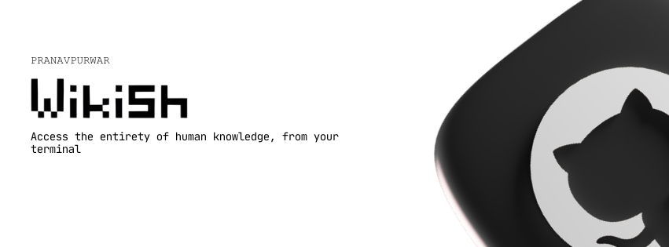

<div align="center">

# WikiSH 🌐
## Terminal Wikipedia Reader


WikiSH is a powerful command-line interface (CLI) tool that lets you search and read Wikipedia articles directly from your terminal.  
It features a clean, rich interface and integrates with AI to provide concise summaries of long articles.

</div>

---

## ✨ Features

- 🔍 **Fast Search**: Instantly search Wikipedia for any topic.
- 📖 **Terminal Reader**: Read full Wikipedia articles with beautiful Markdown formatting and a pager for easy navigation.
- 🤖 **AI Summarization**: Generate 300-word summaries of any article using Llama 3 via Replicate.
- 🎨 **Rich UI**: Utilizes `rich` for a vibrant terminal experience with tables, panels, and colored output.

---

## 🚀 Getting Started

### Prerequisites

- Python 3.8+
- [Replicate API Token](https://replicate.com/account/api-tokens) (optional, for summaries)

### Installation

1. **Clone the repository**:
   ```bash
   git clone https://github.com/yourusername/wikish.git
   cd wikish
   ```

2. **Install dependencies**:
   ```bash
   pip install -r requirements.txt
   ```

3. **Configure Environment**:
   Create a `.env` file in the root directory and add your Replicate API token:
   ```env
   REPLICATE_API_TOKEN=your_token_here
   ```

---

## 🛠 Usage

You can now run the tool using the simplified command:

```bash
.\wiki "Your Search Term"
```

Or using standard Python:

```bash
python main.py "Your Search Term"
```

### Navigation

- **Article Selection**: Enter the index number from the search results to read an article.
- **Reading**: Use arrow keys or Space/PageDown to scroll through the article. Press `q` to exit the pager.
- **Actions**:
  - `s`: Generate an AI summary.
  - `n`: Return to search results to pick another article.
  - `q`: Quit the application.

---

## 📂 Project Structure

```text
wikish/
├── src/                # Source code
│   └── wikish/         # Core package
│       ├── ai.py
│       ├── cli.py
│       ├── models.py
│       ├── search.py
│       └── utils.py
├── examples/           # Sample outputs and usage examples
├── main.py             # Entry point
├── wiki.bat            # Windows shortcut
└── requirements.txt    # Project dependencies
```

## 📦 Dependencies

- `typer`: For CLI argument parsing.
- `rich`: For beautiful terminal formatting.
- `nlpia2-wikipedia`: For accessing Wikipedia content.
- `replicate`: For AI-powered summaries.
- `python-dotenv`: For managing environment variables.
- `mdv`: For terminal markdown viewing.

---

## 📝 License

This project is open-source and available under the MIT License.
